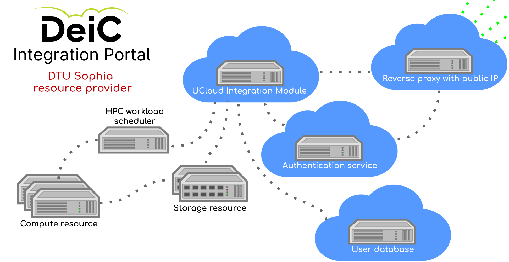
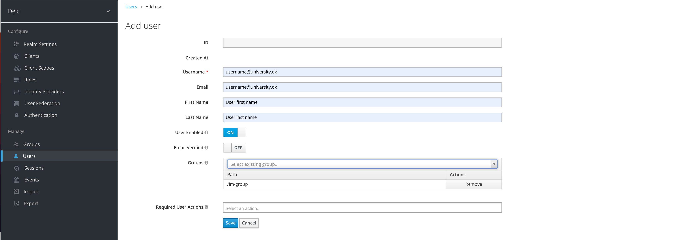
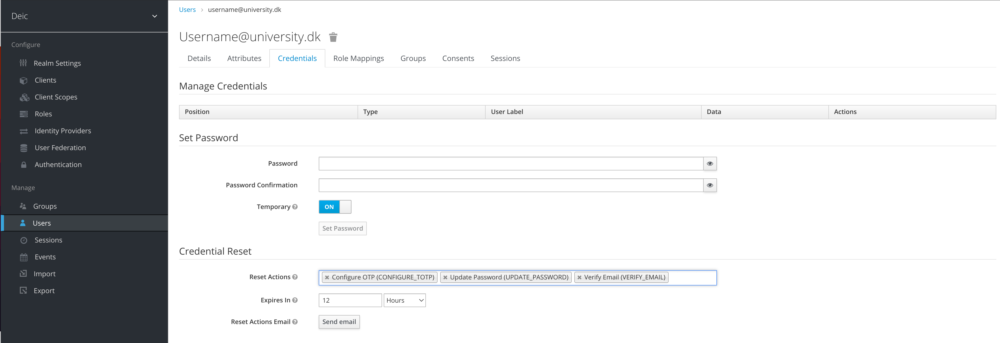
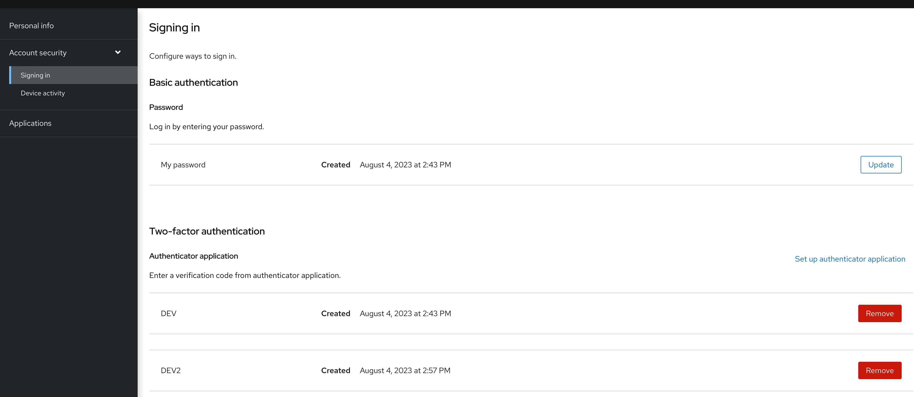
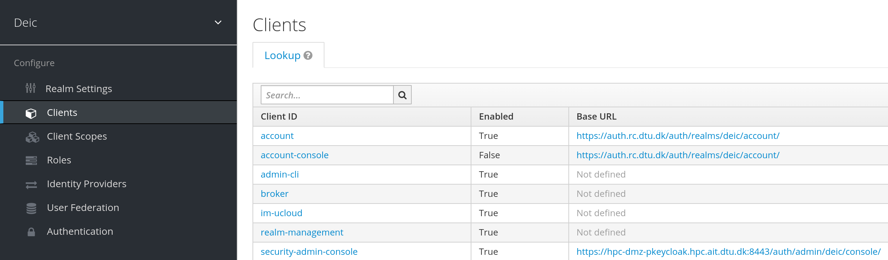
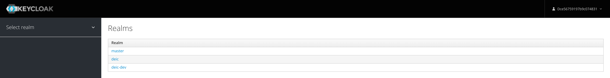
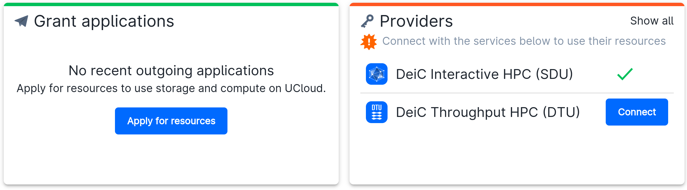
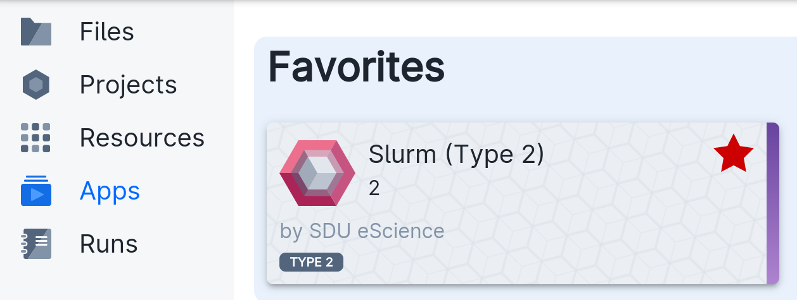
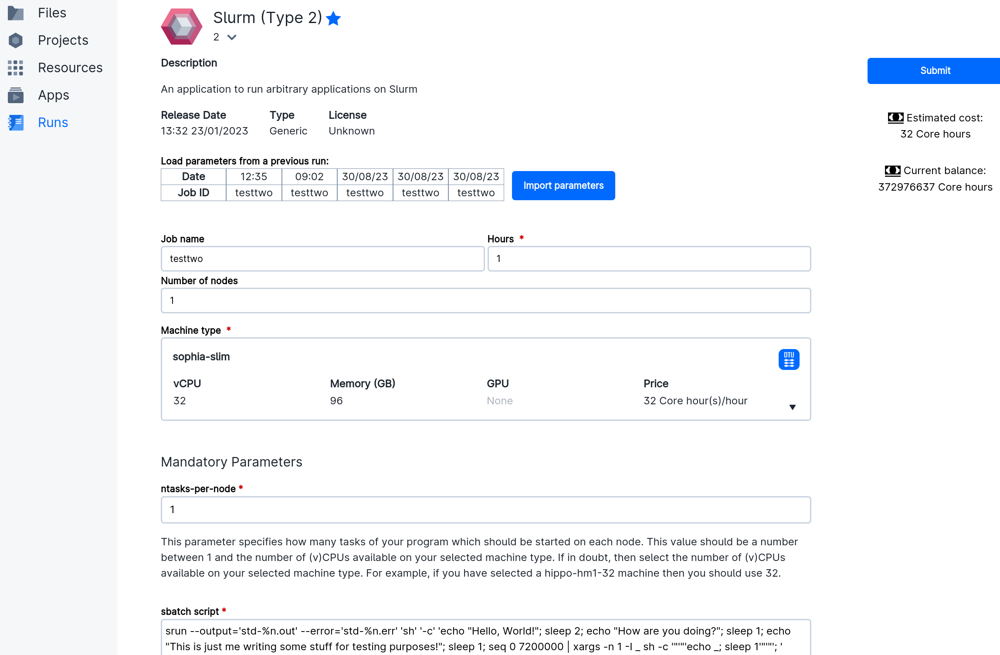
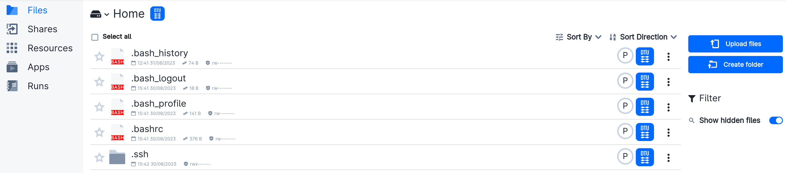

# DTU Sophia Deic Integration Portal resource provider

In the following a description for operating the systems described in DEPLOY.md a **Deic Integration Portal** resource provider is given. Also, the **Deic Integration Portal** is referred to as **UCloud**.  

## Overview

Besides the UCloud Integration Modul software itself, the resource provider must either 

1. rely alone on UCloud's WAYF-based authentication (i.e. *only* user home-institution authentication), or
2. implement *additional local identity and access management* that UCloud forwards to when the resource provider is selected.

The DTU Sophia resource provider configuration went with 2. and is here sketched.


The four "cloud" elements in the infrastructure; what we could call the UCloud Integration Module front end services, denote virtual machine services that can be dynamically migrated around DTU's internal virtualisation environment for more flexibility and uptime, compared to deployment of these services directly on physical servers.

For inspiration on how to get started building a Deic Integration Portal resource provider see the Ansible roles used for this deployment [on GitHub](https://github.com/dtu-sophia/ucloud-im-infrastructure) 

## Authorisation

Once a UCloud user's local HPC Front Office has allocated a UCloud grant the user is authorized to consume resources from all resource providers. Upon selecting e.g. DTU Sophia as resource provider, the user is forwarded to it's local authentication service running on DTU Sophia premises.


The text below the "Sign in" button instructs to contact ait-hpc-support@dtu.dk](mailto:ait-hpc-support@dtu.dk) to request account creation. In the email the user can e.g. be required to include the following information:

1. Full name,
1. Institution,
1. Work email address,
1. Deic grant id.

Upon authorisation, [a DTU Sophia administrator creates](#realm-administration) the user:

and sends a link to the user for email verification, user password update and MFA device registration:


## Authentication

Once the above is done, the user can authenticate using the work email specified during the authorisation process, the password set through the email verification link, and the MFA device.

It is possible for the user to change password or MFA device via the link [https://auth.rc.dtu.dk/auth/realms/deic/account](https://auth.rc.dtu.dk/auth/realms/deic/account).



However, this is currently disabled. It can be enabled by a realm admin via the "Clients" -> "accont-console" menu.



Upon successful authentication the user is forwarded to the UCloud Integration Module service running locally on RP premises.

## Realm administration

| Description | Login via URL |
| ----  | ---   |
| Master realm  | https://iam-host:8443/auth/admin/master/console |
| Deic realm  | https://iam-host:8443/auth/admin/deic/console |
| Deic realm for UCloud development system | https://iam-host:8443/auth/admin/deic-dev/console |

After a new deployment via the IAM Ansible role admin users for `deic` and `deic-dev` realms can be added via the `master` realm link.

To obtain the `master` realm credentials log on the iam-host and do
```
[kcuser@iam-host ~]$ podman secret ls
ID                         NAME        DRIVER      CREATED     UPDATED
02548197ea25328c08cccefb1  pguser      file        2 days ago  2 days ago
35e645f8a7fd176fc4e810f05  kcpwd       file        2 days ago  2 days ago
8a99a5381a8986a4e8b48ecd1  pgpwd       file        2 days ago  2 days ago
955b20d7b666b49b849addeb7  kcuser      file        2 days ago  2 days ago
```
Inspect any of them to grab the path where the credentials are stored;
```
[kcuser@iam-host ~]$ podman secret inspect 955
[
    {
        "ID": "955b20d7b666b49b849addeb7",
        "CreatedAt": "2023-08-04T14:30:35.885782628+02:00",
        "UpdatedAt": "2023-08-04T14:30:35.885782628+02:00",
        "Spec": {
            "Name": "kcuser",
            "Driver": {
                "Name": "file",
                "Options": {
                    "path": "/home/kcuser/.local/share/containers/storage/secrets/filedriver"
                }
            },
            "Labels": {}
        }
    }
]
[kcuser@iam-host ~]$ cat /home/kcuser/.local/share/containers/storage/secrets/filedriver/secretsdata.json 
{
  "02548197ea25328c08cccefb1": "OWI0ZmVlMjI3ZTMwZDZiYjEzN2Q=",
  "35e645f8a7fd176fc4e810f05": "U1gzMFJ6d3h1WnZGRHo3UUw5UVRmODMwY3FjPQ==",
  "8a99a5381a8986a4e8b48ecd1": "dDJlN2hqd2VVZ2REblJyY0VqOD0=",
  "955b20d7b666b49b849addeb7": "ZGNlNTY3NTkxOTdiOWMwNzQ4MzE="
```
Infer from the `podman secret ls` output which of these four are `kcuser` and `kcpwd`, respectively. Decode the values to retrieve the `master` realm user and password:
```
[kcuser@iam-host ~]$ master_user=$(echo -n "ZGNlNTY3NTkxOTdiOWMwNzQ4MzE=" | base64 --decode)
[kcuser@iam-host ~]$ master_password=$(echo -n "U1gzMFJ6d3h1WnZGRHo3UUw5UVRmODMwY3FjPQ==" | base64 --decode)
[kcuser@iam-host ~]$ echo -e "  master realm user     --> $master_user\n  master realm password --> $master_password"
  master realm user     --> dce56759197b9c074831
  master realm password --> SX30RzwxuZvFDz7QL9QTf830cqc=
```
Use these credentials to log on https://iam-host:8443/auth/admin/master/console



Choose the `deic` or `deic-dev` realm and follow the [user creation process described above](#authorisation), but in the 'Add user' tab choose group membership `realm-admin` (admin privileges) in addition to `im-group` (providing regular user authentication for the UCloud Integration Module). 

## Running computations

Before the user can connect to compute resources the user must be part of a UCloud project that grants access to a given provider. The local HPC front office can help with that. 

Apply for resources and connect:



When a user has 

1. logged into [Deic Integration Portal](https://cloud.sdu.dk),
1. made it through the [authorisation process](#authorisation), and
1. [successfully authenticated](#authentication) to use DTU Sophia resources,

the user is forwarded to the DTU Sophia authentication web site. 


Select an app



and submit a job. 



DTU Sophia has only one compute node type; *32 core amd epyc 7302 with 96GB memory*.

Manage local files via the file manager menu to the left.


